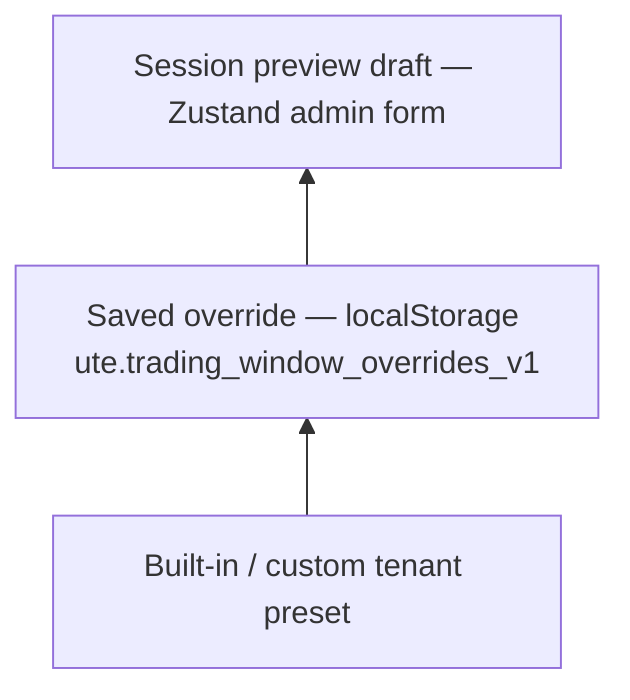

# UTE Trading Window Presets

**Project:** 07-UTE  
**Depends on:** White-label engine Phases 1–4 (`docs/UTE_WHITELABEL_THEME.md`)  
**Date:** 2026-05-18

---

## Phase 1 — Types, registry, resolver (implemented)

**Status:** Shipped in `src/tradingWindow/` — minimal UI surface (`data-ute-twp-*`, workspace class hooks on `UniversalMarketView`).

### Delivered

| Module | Role |
|--------|------|
| `tradingWindowPresetTypes.ts` | `TradingWindowPreset` + sub-presets (`OrderBookPreset`, `ChartLayoutPreset`, `PositionPanelPreset`, `OrderFormPreset`, `SpeedOrderPreset`, `MobileTradingPreset`) |
| `mockTradingWindowProfiles.ts` | Five profiles: `private-bank`, `broker-hts`, `global-futures`, `institutional-desk`, `mobile-mts` |
| `tradingWindowPresetRegistry.ts` | Tenant map + `attachTradingWindowToPreset` |
| `validateTradingWindowPreset.ts` | Schema validation (`mockOnly: true`, stack slots, level counts) |
| `resolveTradingWindowBundle.ts` | `resolveTradingWindowBundle(tenantPreset)` → preset + `htsGrid` + class map + `data-ute-twp-*` |
| `useTradingWindowBundle.ts` | Hook gated by `shouldEnableTradingWindowPresets` |
| `tradingWindowSelfTest.ts` | Schema, resolver, invalid fallback, no-network guard |
| `TradingWindowDiagnosticsSection.tsx` | Platform diagnostics strip |

### Mock tenant wiring

| Tenant | Profile |
|--------|---------|
| GOLDX (`goldx`) | `private-bank` |
| BLUETRADE (`bluetrade`) | `broker-hts` |
| PRIME FUTURES (`prime-futures`) | `global-futures` |
| BLACK DESK / MOBI-X | `institutional-desk` / `mobile-mts` in `TRADING_WINDOW_REGISTRY_CANDIDATES` only |

### Feature flag

- Env: `VITE_UTE_ENABLE_TRADING_WINDOW_PRESETS` → `chrome.enableTradingWindowPresets`
- Default: `true` in `DEFAULT_LAYOUT_FLAGS`; `false` in emergency profile
- Requires `enableWhitelabelPresets` (see `shouldEnableTradingWindowPresets` in `layoutUiGuards.ts`)

### Self-test IDs (`runUteSelfTestSuite.ts`)

- `trading-window-preset-schema`
- `trading-window-preset-resolver`
- `trading-window-invalid-fallback`
- `trading-window-no-api-no-websocket`

### Phase 2 readiness

`resolveTradingWindowBundle` already exposes `htsGrid: { chart, orderBook, orderPanel }` per profile. Phase 2 can pass these weights into `HtsLayout` without changing preset types.

---

## Phase 2 — HtsLayout grid weights (implemented)

**Status:** `htsGrid` drives `HtsLayout` column proportions via CSS variables (`--ute-twp-flex-*`) and optional pixel seeding for resize handles.

| Piece | Role |
|-------|------|
| `tradingWindowHtsGridCss.ts` | CSS vars, `data-ute-twp-grid-*`, share % helper |
| `seedHtsLayoutFromGrid.ts` | Weight → initial `bookPx` / `orderPx` on profile switch |
| `HtsLayout.tsx` | `htsGrid` prop, `ute-twp-hts-grid-active` class |
| `index.css` | Flex rules for chart / book / order cells |
| `TradingWindowHtsGridPreview.tsx` | Tenant Preview Center strip |
| Self-test | `trading-window-grid-private-bank`, `…-broker-hts`, `…-global-futures`, `…-grid-no-api-no-websocket` |

**Phase 3** can apply sub-preset classes to individual panels (`OrderBookPanel`, `OrderPanel`, dock) without changing grid plumbing.

---

## Phase 3 — Panel chrome (implemented)

**Status:** Profile-specific order book / order form / dock chrome via CSS wrappers on `UniversalMarketView`.

| Piece | Role |
|-------|------|
| `tradingWindowPanelChrome.ts` | Density / form / dock tab chrome resolution + `classNames` |
| `panels/TradingWindow*Chrome.tsx` | Wrappers (spread badge, fast-order strip, margin strip) |
| `panels/wrapTradingWindowPanelChrome.tsx` | `UniversalMarketView` integration helpers |
| `index.css` | `.ute-twp-ob-chrome-*`, `.ute-twp-form-chrome-*`, `.ute-twp-dock-tabs-*` |
| `TradingWindowPanelChromePreview.tsx` | Tenant Preview Center strip |

**Phase 4** can add Preview Center wireframe compare + custom tenant panel overrides in admin console.

---

## Phase 4 — Admin override / live preview (implemented)

**Status:** `TradingWindowAdminConsole` on `/admin` (with WhiteLabel admin flag).

| Piece | Role |
|-------|------|
| `override/tradingWindowOverrideStorage.ts` | `ute.trading_window_overrides_v1` localStorage |
| `override/tradingWindowOverrideStore.ts` | Zustand: saved overrides + live preview draft |
| `override/tradingWindowOverrideModel.ts` | Admin form ↔ override blob ↔ merged preset |
| `admin/TradingWindowAdminConsole.tsx` | Tenant/profile/grid/chrome/mobile editors |
| `admin/TradingWindowOverrideCompareStrip.tsx` | Baseline vs draft compare |
| `resolveTradingWindowBundle.ts` | Reads effective override per tenant id |

Live preview: `setPreviewFromForm` bumps `revision` → `useTradingWindowBundle`, Preview Center strips, Diagnostics.

---

## Phase 5 — Mobile visual editor, merge layer, import/export (implemented)

**Status:** Visual editor + 3-tier merge + wireframe strip + clipboard/textarea import/export.

| Piece | Role |
|-------|------|
| `mobile/TradingWindowMobileStackEditor.tsx` | Mock drag (↑↓ + HTML5 drag), visual presets, thumb-zone / bottom-sheet preview |
| `mobile/mobileStackPreview.ts` | `compact` · `balanced` · `futures` · `mobile-mts` stack metadata |
| `mobile/mobileStackWireframe.ts` | Desktop HTS + mobile MTS wireframe models |
| `override/resolveTradingWindowMerge.ts` | `resolveEffectiveOverride` + `resolveTradingWindowMerge` |
| `override/tradingWindowOverrideImportExport.ts` | Export JSON (clipboard); import (textarea paste); schema + `mockOnly` gate |
| `admin/TradingWindowOverrideImportExportPanel.tsx` | Admin UI for import/export |
| `preview/TradingWindowWireframeStrip.tsx` | Preview Center: HTS grid, MTS stack, dock open, book emphasis |

### Merge priority (3-tier)

Higher layer wins when present for the active tenant id:



| Priority | Source | `data-ute-twp-merge-source` |
|----------|--------|-----------------------------|
| 1 (base) | Tenant `tradingWindow` on whitelabel preset | `tenant-preset` |
| 2 | Saved override blob | `saved-override` |
| 3 (highest) | Live admin preview draft | `preview-draft` |

`resolveTradingWindowBundle()` calls `resolveTradingWindowMerge()` and exposes merge metadata on `data-ute-twp-*` attributes.

### Mobile stack visual presets (examples)

| Preset id | Typical stack (top → bottom) | Notes |
|-----------|------------------------------|-------|
| `compact` | ticker → chart → book → order → history | Dense MTS; smaller thumb band |
| `balanced` | ticker → chart → book → order → history | Default retail MTS |
| `futures` | ticker → chart → **order** → book → history | Order-first thumb zone |
| `mobile-mts` | ticker → chart → book → order → history | Sticky bottom sheet on order + book |

Override blob fields (Phase 5): `mobileVisualPreset`, `mobileStackOrder[]` — stored in the same localStorage key; no file auto-read.

### Import / export rules

- **Export:** clipboard text only (`navigator.clipboard` with console fallback).
- **Import:** admin textarea paste → `parseOverridesImport` → `importOverrides()`.
- **Rejected:** `mockOnly !== true`, schema version mismatch, invalid rows (WARN for partial invalid).
- **Forbidden:** `fetch`, file picker auto-read, WebSocket.

### Phase 5 self-test IDs

| ID | Assertion |
|----|-----------|
| `trading-window-mobile-stack` | Visual presets + `normalizeStackOrder` |
| `trading-window-override-import-export` | JSON round-trip + `mockOnly` enforcement |
| `trading-window-merge-priority` | preview > saved > tenant |
| `trading-window-wireframe-preview` | bundle merge attrs + HTS grid |
| `trading-window-phase5-no-api-no-websocket` | no network in Phase 5 surfaces |

---

## Phase 0 (Design)

**Status:** Reference below — design baseline for Phases 2+.

---

## 1. Purpose

Extend the existing **tenant white-label** model so the **trading workspace** (chart · order book · order form · positions dock · mobile stack) can look and lay out like different broker products while:

- Using the **same** `BrokerAdapter` + `useTradingStore` execution path (mock today).
- **Not** forking per-tenant React trees or copying `05-SpeedOrder` source into `07-UTE`.
- **Not** changing order submission, matching, or fill semantics.

**Design metaphor:** One engine, many **trading window skins** — analogous to shell theme/menu presets, but scoped to `UniversalMarketView` / `HtsLayout` / `TradingLayout` slots.

---

## 2. Non-goals (absolute)

| Rule | Rationale |
|------|-----------|
| No live trading API / WebSocket / polling | Same as UTE product stance; presets are CSS/layout/visibility only. |
| No order engine changes | `submitOrder` → `adapter.placeOrder` contract unchanged. |
| No edits inside **05-SpeedOrder** repo | Integration via `IntegrationSlot` + `src/vendor/` contract surface only. |
| Do not remove **UtePlatformShell** | Platform chrome stays; trading presets apply inside workspace `children`. |
| No per-tenant code copy | New brand = registry row + preset JSON, not `GoldxOrderPanel.tsx`. |
| **mockOnly: true** on all preset blobs | Enforced in schema validation (future Phase 1). |

---

## 3. Placement in the stack

```text
UtePlatformShell          ← theme, menu, sidebar (existing whitelabel)
  └─ UtePremiumTradingShell   ← market tabs, mock side cards (unchanged role)
       └─ ViewFor / UniversalMarketView   ← **Trading Window Preset applies here**
            ├─ HtsLayout (lg+)           ← grid weights, slot visibility
            └─ TradingLayout (<lg)       ← MobileTradingPreset
```

**Single resolver entry (planned):**

`resolveTradingWindowPreset(tenantPreset) → TradingWindowBundle`

- Input: active `TenantWhitelabelPreset` (built-in or custom from Phase 4 console).
- Output: normalized sub-presets + CSS class map + `data-ute-twp-*` attributes for diagnostics.

**Composition rule:** Presets **decorate** existing panels (`OrderPanel`, `OrderBookPanel`, `TradingViewChart`, `BottomDock`) — they do not replace store selectors or adapter wiring.

---

## 4. Data model

### 4.1 Schema version

```ts
TRADING_WINDOW_SCHEMA_VERSION = '1.0.0'
```

All blobs include `mockOnly: true` and `schemaVersion`.

### 4.2 `TradingWindowPreset` (root)

| Field | Type | Role |
|-------|------|------|
| `profileId` | enum | High-level product archetype (see §5). |
| `label` | string | Operator-facing name in Preview Center. |
| `orderBook` | `OrderBookPreset` | Hoisted book layout & density. |
| `chartLayout` | `ChartLayoutPreset` | Chart toolbar, timeframe strip, DOM strip. |
| `positionPanel` | `PositionPanelPreset` | Bottom dock tabs, columns, emphasis. |
| `orderForm` | `OrderFormPreset` | Order ticket layout & field prominence. |
| `speedOrder` | `SpeedOrderPreset` | 05 integration chrome (badge, module labels). |
| `mobile` | `MobileTradingPreset` | Stack order, sticky regions, thumb zones. |

**Attachment to tenant (planned):**

```ts
type TenantWhitelabelPreset = {
  // …existing theme, layout, menu, admin…
  tradingWindow: TradingWindowPreset
}
```

Custom tenants (Phase 4 `TenantCustomRecord`) inherit `tradingWindow` from `sourcePresetId` with optional partial overrides — same pattern as `navOverrides`.

### 4.3 `OrderBookPreset`

| Field | Values | UI effect |
|-------|--------|-----------|
| `layout` | `two-column` \| `center-ladder` \| `compact-ladder` \| `depth-heatmap` | Column geometry (mock heatmap = background tint only). |
| `levelCount` | `10` \| `15` \| `20` | Visible rows (slice mock book; no new feed). |
| `spreadHighlight` | `subtle` \| `bold` \| `none` | Mid/spread row styling. |
| `clickToFill` | `on` \| `off` | UI affordance only; fills order form from mock price (existing behavior gated). |
| `density` | `compact` \| `standard` \| `airy` | Row height / font scale tokens. |

**Engine:** Still `board.orderBook` from store; preset only affects presentation.

### 4.4 `ChartLayoutPreset`

| Field | Values | UI effect |
|-------|--------|-----------|
| `toolbar` | `minimal` \| `standard` \| `pro` | Buttons visible on chart chrome strip. |
| `timeframeStrip` | `hidden` \| `top` \| `floating` | Placement of TF chips (mock labels). |
| `domStrip` | `hidden` \| `bottom` \| `side` | DOM ladder attachment (visual only until 05 chart). |
| `studies` | `off` \| `badges-only` \| `expanded` | Indicator slot density. |
| `aspectPolicy` | `fill` \| `fixed-16-9` | Flex min-height behavior in `HtsLayout` chart pane. |

**Integration:** `TradingViewChart` remains interim; preset documents target layout for future `05` `ChartArea` drop-in.

### 4.5 `PositionPanelPreset`

| Field | Values | UI effect |
|-------|--------|-----------|
| `dockHeight` | `short` \| `standard` \| `tall` | Default dock split % (respects user `proLayout` persistence when present). |
| `defaultTab` | `positions` \| `open-orders` \| `fills` \| `history` | Initial tab on market switch. |
| `columnSet` | `retail` \| `pro` \| `institutional` | Which columns show in tables (mock data columns only). |
| `pnlEmphasis` | `muted` \| `standard` \| `hero` | uPnL typography in dock header. |
| `showMarginBlock` | boolean | Futures/margin summary block visibility. |

**Component:** `BottomDock` + dock placeholders; no new position store.

### 4.6 `OrderFormPreset`

| Field | Values | UI effect |
|-------|--------|-----------|
| `layout` | `vertical` \| `horizontal-split` \| `ticket-compact` \| `institutional-ticket` | Grid of inputs. |
| `primaryAction` | `buy-sell-tabs` \| `side-toggle` \| `dual-buttons` | CTA pattern. |
| `advanced` | `collapsed` \| `accordion` \| `always-visible` | SL/TP, OCO, hedge toggles (`CategoryConfig` still gates fields). |
| `qtyInput` | `shares` \| `notional` \| `contracts` | Label/copy; validation still from `SymbolSpec`. |
| `confirmModal` | `off` \| `mock-only` | Extra confirm step (UI guard; no send). |

**Component:** `OrderPanel`; `readOnly` still from layout flags, not preset.

### 4.7 `SpeedOrderPreset`

| Field | Values | UI effect |
|-------|--------|-----------|
| `integrationState` | `planned` \| `in-progress` \| `integrated` | `IntegrationSlot` badge color/text. |
| `moduleLabels` | record | Overrides for slot `module` strings in `UniversalMarketView`. |
| `hotkeysStrip` | `hidden` \| `mock` | Non-functional hotkey hints (05 future). |
| `vendorSnapshot` | `off` \| `strip` | Show `readSpeedOrderVendorSerializableSnapshot()` summary chip. |

**Boundary:** Reads `src/vendor/` + `useBridgeDashboardStore`; **never** imports 05 repo paths.

### 4.8 `MobileTradingPreset`

| Field | Values | UI effect |
|-------|--------|-----------|
| `stackOrder` | ordered slot ids | e.g. `ticker → chart → book → order → history`. |
| `stickyHeader` | `ticker` \| `chart-toolbar` \| `none` | Sticky region under `TradingLayout`. |
| `bottomSheetOrder` | `off` \| `half` \| `full` | Order panel presentation on small screens. |
| `thumbZone` | `left` \| `right` \| `balanced` | Primary buy/sell alignment. |
| `compactTicker` | boolean | Ticker bar single-line mode. |

**Trigger:** `layoutFlags.forceMobileStack` or `layoutPreset === 'mobile'` — preset chooses order, not breakpoint logic itself.

---

## 5. Profile catalog (mock tenants)

Maps **brand narrative** → `profileId` → sub-presets. Built-in registry rows (Phase 1+) — **no new TSX per brand**.

| Tenant | `profileId` | Trading window character |
|--------|-------------|---------------------------|
| **GOLDX** | `private-bank` | Wide chart, muted book, hero PnL, vertical ticket, low clutter — **프라이빗뱅크형** |
| **BLUETRADE** | `broker-hts` | Classic HTS: center-ladder book, standard dock, buy/sell tabs — **증권사 HTS형** |
| **PRIME FUTURES** | `global-futures` | Compact book, pro chart toolbar, margin block, dual buttons — **해외선물/바이낸스형** |
| **BLACK DESK** (new) | `institutional-desk` | Tall dock, institutional columns, horizontal-split ticket, depth-heatmap book — **기관 데스크형** |
| **MOBI-X** (new) | `mobile-mts` | Mobile-first stack, bottom-sheet order, compact ticker — **모바일 MTS형** (desktop falls back to readable HTS) |

**Note:** BLACK DESK / MOBI-X are **design-time** registry entries for Phase 1; they reuse the same engine as GOLDX/BLUETRADE/PRIME.

### 5.1 Example snapshot (BLUETRADE — abbreviated)

```json
{
  "schemaVersion": "1.0.0",
  "mockOnly": true,
  "profileId": "broker-hts",
  "label": "증권사 HTS",
  "orderBook": { "layout": "center-ladder", "levelCount": 15, "spreadHighlight": "bold", "clickToFill": "on", "density": "standard" },
  "chartLayout": { "toolbar": "standard", "timeframeStrip": "top", "domStrip": "hidden", "studies": "badges-only", "aspectPolicy": "fill" },
  "positionPanel": { "dockHeight": "standard", "defaultTab": "positions", "columnSet": "retail", "pnlEmphasis": "standard", "showMarginBlock": false },
  "orderForm": { "layout": "vertical", "primaryAction": "buy-sell-tabs", "advanced": "accordion", "qtyInput": "shares", "confirmModal": "off" },
  "speedOrder": { "integrationState": "in-progress", "hotkeysStrip": "mock", "vendorSnapshot": "strip" },
  "mobile": { "stackOrder": ["ticker","chart","book","order","history"], "stickyHeader": "ticker", "bottomSheetOrder": "half", "thumbZone": "balanced", "compactTicker": true }
}
```

---

## 6. UI preset application (implementation pattern)

### 6.1 Resolver outputs

```ts
type TradingWindowBundle = {
  preset: TradingWindowPreset
  htsGrid: { chart: number; orderBook: number; orderPanel: number } // flex weights
  classNames: {
    workspace: string
    orderBook: string
    chart: string
    orderPanel: string
    dock: string
  }
  dataAttributes: Record<string, string> // data-ute-twp-profile, etc.
}
```

### 6.2 Hook (planned)

`useTradingWindowPreset()` → reads `useTenantWhitelabelStore().preset.tradingWindow`, memoizes bundle.

### 6.3 `UniversalMarketView` integration (Phases 2–3)

- Wrap `HtsLayout` with `data-ute-twp-profile={profileId}`.
- Pass `defaultSizes` / `minSize` hints from bundle (extends `usePersistedProLayout` — user resize wins after first paint).
- `SlotWrap` labels from `speedOrder.moduleLabels`.
- **No** conditional import of alternate panel components in Phase 1–2; use class modifiers on existing panels:

```tsx
<OrderBookPanel className={bundle.classNames.orderBook} … />
```

### 6.4 Relationship to shell white-label

| Layer | Controls |
|-------|----------|
| Theme (`tenantThemeConfig`) | Colors, fonts, chart *color* style |
| Shell layout (`tenantLayoutPreset`) | Platform sidebar, topbar, card chrome |
| Menu (`tenantMenuPreset`) | Platform nav only |
| **Trading window** (`TradingWindowPreset`) | **Inside** market view only |

Precedence: `layoutFeatureFlags` (emergency, read-only) **>** trading window preset **>** defaults.

---

## 7. Reuse: 02-TGX-CEX & 04-MockInvest

### 7.1 02-TGX-CEX (`src/cex/`, bridges)

| UTE surface | TGX reuse (mock) |
|-------------|------------------|
| Symbol universe / selection | `selectedSymbol`, `symbolUniverse` shapes for sidebar consistency |
| Market data status badge | Chart toolbar “feed” chip (mock status text) |
| Position/order snapshot | Dock column formatting hints — **display** of store positions, not merge of live TGX store |
| Ticker snapshot | Ticker bar secondary line |

**Rule:** CEX bridge remains **read-only** into UI labels; trading window preset must not call TGX HTTP client.

### 7.2 04-MockInvest (`src/mockinvest/`, bridges)

| UTE surface | MockInvest reuse (mock) |
|-------------|-------------------------|
| Tournament / ranking | Optional **side strip** in `private-bank` / `broker-hts` profiles (hidden by default) |
| Reward pool state | Dock tab badge “Tournament (mock)” — `IntegrationSlot` `gameHub` / `mockInvest` flags |
| Mobile profile `MOBI-X` | Promote compact “랭킹” entry via `MobileTradingPreset.stackOrder` optional slot |

**Rule:** No prize payout, no wallet transfer UI; badges only.

### 7.3 05-SpeedOrder (`src/vendor/`, `IntegrationSlot`)

| Phase | Action |
|-------|--------|
| Now | `SpeedOrderPreset` drives slot badges + copy in `UniversalMarketView`. |
| Later | When 05 modules mount inside slots, preset switches `state="integrated"` and passes **layout props** into slot children via React context (`TradingWindowPresetContext`) — still no 05 repo edits. |

---

## 8. Phase implementation plan

| Phase | Scope | Deliverables |
|-------|--------|--------------|
| **0** | Design | This document; schema sign-off; MASTER_MANUAL link. |
| **1** | Types + registry | `tradingWindowPresetTypes.ts`, extend `mockTenantPresets`, `validateTradingWindowPreset`, `resolveTradingWindowBundle` (classes only, minimal visual change). |
| **2** | HtsLayout grid | Flex weights + dock height defaults from preset; feature flag `enableTradingWindowPresets`. |
| **3** | Panel chrome | Order book layout modes, order form layout modes, mobile stack order; `data-ute-twp-*` on panels. |
| **4** | Preview & admin | Trading Window strip in Tenant Preview Center; overrides in Admin Console + localStorage. |
| **5** | Mobile visual editor + merge + I/O | Mobile stack editor, 3-tier merge, wireframe strip, import/export, diagnostics + self-tests (§9). |
| **6** (optional) | BLACK DESK / MOBI-X registry | Two new built-in tenants; preview cards. |

**Out of scope for Phases 1–4:** Replacing `TradingViewChart` with 05 DOM; live CEX order routing.

---

## 9. Self-test & diagnostics plan

### 9.1 Self-test checks (future)

| ID | Verdict | Assertion |
|----|---------|-----------|
| `trading-window-preset-schema` | PASS/FAIL | All built-in tenants validate `TradingWindowPreset`. |
| `trading-window-profile-registry` | PASS/FAIL | GOLDX/BLUETRADE/PRIME + BLACK DESK/MOBI-X profiles present. |
| `trading-window-bundle-resolver` | PASS/FAIL | `resolveTradingWindowBundle` returns grid weights + classes. |
| `trading-window-flag-guard` | PASS/FAIL | Emergency / read-only unchanged; preset does not bypass `isOrderPanelReadOnly`. |
| `trading-window-no-api` | PASS | Documented PASS — no network side effects. |

Append to `runUteSelfTestSuite.ts` after Phase 5; mirror pattern from `whitelabel-menu-order`.

### 9.2 Diagnostics panel (future)

**Section:** `TradingWindowDiagnosticsSection` (alongside `WhitelabelDiagnosticsSection`).

Display:

- `profileId`, `label`
- Active sub-preset summary (book layout, chart toolbar, dock tab)
- Resolved flex weights
- `mockOnly: true`
- Mismatch warning if custom tenant override fails validation

### 9.3 Preview Center (Phase 4 UI)

- Mini **wireframe strip**: chart | book | order proportions.
- Side-by-side compare: current tenant vs source preset (reuse `TenantAdminCompareStrip` pattern).
- Mobile stack preview list from `MobileTradingPreset.stackOrder`.

---

## 10. Feature flags (planned)

| Env | Chrome flag | Default |
|-----|-------------|---------|
| `VITE_UTE_ENABLE_TRADING_WINDOW_PRESETS` | `enableTradingWindowPresets` | `true` (dev), togglable |

When `false`: `broker-hts` profile defaults hard-coded in resolver (same visual as today). Emergency profile does not need to disable unless QA requires it.

---

## 11. File plan (reference — not implemented in Phase 0)

```text
src/tradingWindow/
  tradingWindowPresetTypes.ts
  mockTradingWindowProfiles.ts      # profileId → TradingWindowPreset defaults
  resolveTradingWindowBundle.ts
  tradingWindowClasses.ts
  validateTradingWindowPreset.ts
  TradingWindowPresetContext.tsx
  tradingWindowSelfTest.ts
  preview/
    TradingWindowPreviewStrip.tsx
```

Extend:

- `src/whitelabel/mockTenantPresets.ts` — add `tradingWindow` per tenant.
- `src/markets/views/UniversalMarketView.tsx` — consume context/classes.
- `docs/UTE_WHITELABEL_THEME.md` — link to this doc.

---

## 12. Risks & mitigations

| Risk | Mitigation |
|------|------------|
| Preset fights user-resized layout | Apply defaults once per tenant switch; persist user layout in `proLayout` storage. |
| Divergence from `CategoryConfig` | Order form **visibility** = intersection of `CategoryConfig` ∧ `OrderFormPreset`. |
| 05 integration assumes single layout | `SpeedOrderPreset` only affects slot chrome until 05 provides layout props API. |
| Mobile/desktop duplicate logic | `MobileTradingPreset` only used when `forceMobileStack`; desktop uses `HtsLayout` bundle. |

---

## 13. Related documents

- `docs/UTE_WHITELABEL_THEME.md` — Shell theme, menu, admin config.
- `docs/UNIVERSAL_TRADING_UI_CONTRACT.md` — Market-agnostic panel contracts.
- `docs/UTE_LAYOUT_FEATURE_FLAGS.md` — Emergency / read-only guards.
- `docs/UTE_ARCHITECTURE.md` — Layers, `IntegrationSlot`, bridges.
- `docs/MOBILE_TRADING_SYSTEM.md` — Responsive rules.
- `docs/TGX_VENDOR_SYNC.md` / `docs/ONEAI_BRIDGE.md` — Partner surfaces (read-only).

---

## 14. Maintenance

When `TradingWindowPreset` schema or registry changes, update this file and `MASTER_MANUAL.md` per `AGENTS.md`.
